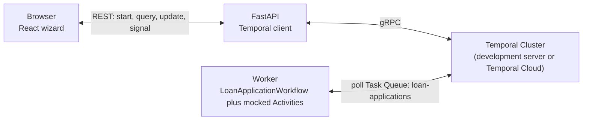
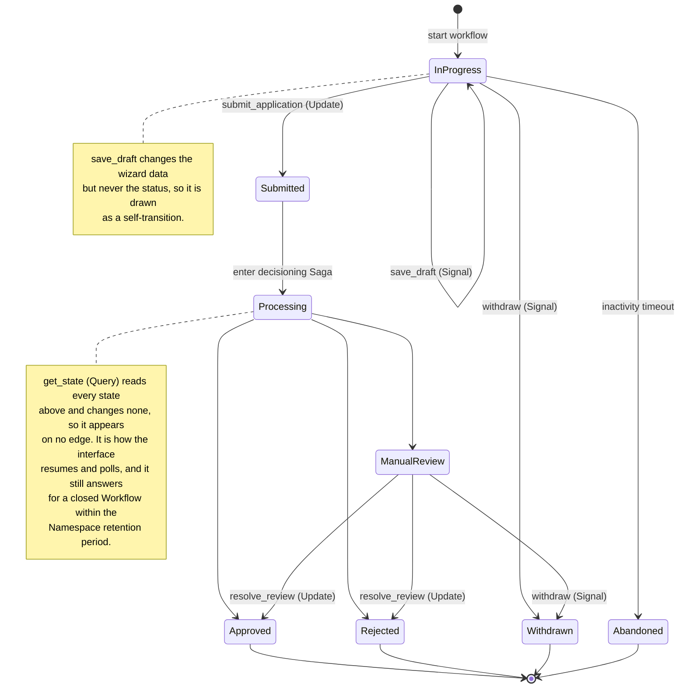
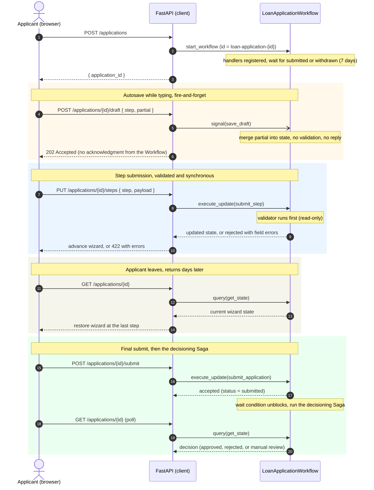
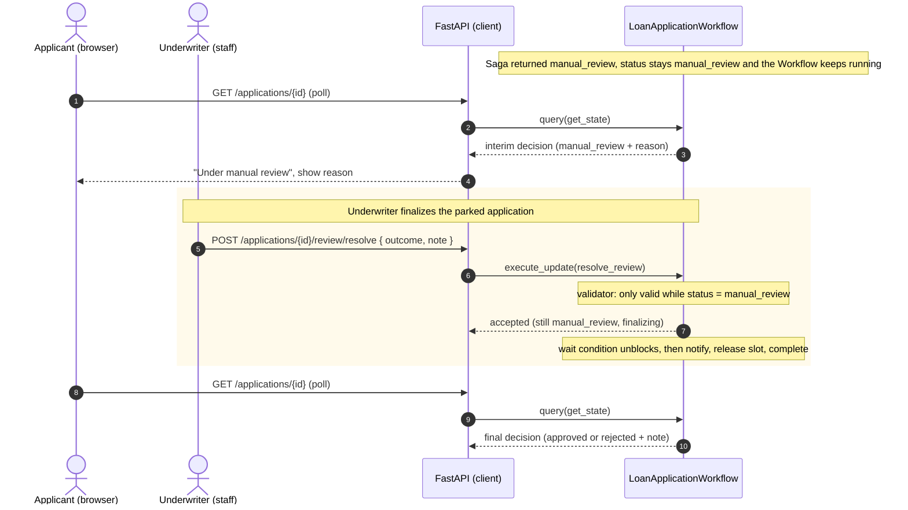
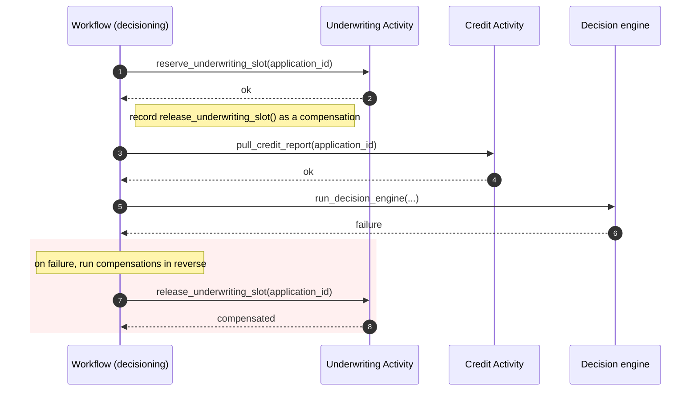

# Orchestrate a Resumable Loan Application Wizard Using Temporal Signals and Queries

## Metadata

**Product tags:** Temporal Workflows, Temporal Activities, Temporal Signals, Temporal Queries, Temporal Updates, Temporal Python SDK, FastAPI, React, Pydantic

**Authors:** Ci-Ci Thomson

**Estimated Duration:** 10 minutes

## Introduction

### Executive summary 
A loan application moves through several steps, and applicants often pause for hours or days while they gather documents.
This pattern models the whole application as one durable Temporal Workflow that holds the wizard state, validates each step, and resumes wherever the applicant left off.

### Problem statement
A multi-step web wizard spreads its state across the browser, a session cache, and a database. 
Keeping those stores in sync, expiring abandoned sessions, and resuming a half-finished application takes custom glue code that is error-prone and hard to observe.

### Solution
Run one long-lived Workflow per application.
Use an Update to submit and validate each step and return a synchronous result, a Query to read the state when the applicant returns, and Signals for fire-and-forget events such as autosave and withdrawal.
Temporal persists the state, so the wizard is resumable without a separate session store.

### Outcomes
By following this implementation plan, you will:

- Resume any application by its identifier with a Query, without a separate session store.
- Validate every step at the source of truth with an Update validator, so invalid input never enters the Event History.
- Decide whether each applicant action should be an Update, a Query, or a Signal, based on whether it needs a validated reply, a read of current state, or fire-and-forget delivery.
- Observe the full lifecycle of an application as one Event History in the Temporal Web user interface (UI).

## Background and best practices

A loan wizard asks an applicant to gather documents, verify income, and review terms — work that often spans hours or days across multiple browser sessions.
Traditional implementations hold that in-progress state in a combination of the browser, a session cache, and a database, and need custom code to keep those stores synchronized, expire abandoned sessions, and recover a partial flow after a crash.
Durable execution treats the whole wizard as a single, long-lived object: the Workflow holds the state, survives Worker restarts, and resumes wherever the applicant left off without a separate session store.

### Why durable execution fits a wizard

A traditional wizard stores its progress in a browser, a session cache, and a database, and needs glue code to keep them consistent, to expire abandoned sessions, and to restore a partial flow.
With Temporal, the Workflow holds the state and Temporal persists it.
If a Worker restarts or you redeploy it mid-flow, the Workflow continues where it stopped.
Resuming on day three is a Query against a Workflow that has been waiting.

This is an entity Workflow.
It is a long-lived, stateful object that represents one application.
It receives events such as steps, drafts, and withdrawal over time, and it answers state queries.

### Choosing the right primitive

The title names Signals and Queries, and this pattern uses both.
For submitting a step, though, the right primitive is an Update, not a Signal:

| Need | Primitive | In this pattern |
| :--- | :--- | :--- |
| Send a step and get a validated, synchronous result | Update | `submit_step`, `submit_application`, `resolve_review` |
| Read state with no change | Query | `get_state` (resume, poll for the decision) |
| Send an event that needs no acknowledgment | Signal | `save_draft` (autosave), `withdraw` |

A Signal is fire-and-forget, so the sender receives no return value and no validation result.
A Signal cannot report whether the Workflow accepted the step.
To find out, you would submit the step with a Signal and then poll with a separate Query.
An Update eliminates the extra Query call, because Update returns a result directly.
An Update validator runs before the Update enters history and must be read-only, which fits synchronous step validation.
One useful property follows from this.
Temporal does not record validation-rejected Updates in Event History, so failed attempts do not bloat the log.

Autosave is a good fit for a Signal.
The interface streams partial field values that should persist on a best-effort basis, with no validation and no need to block the applicant.
Because a draft holds unsaved input rather than committed data, a dropped Signal carries no risk.
The applicant re-enters a small amount of text, and the validated step submission remains the source of truth.
Withdrawal is also fire-and-forget.

### One set of types across the boundary

Wizard data, state, and the decision are Pydantic models. 
The same models serialize across the Temporal client and Worker boundary through the `pydantic_data_converter`, and they back the FastAPI request bodies, so you define the contracts once. 
The React UI consumes the resulting JavaScript Object Notation (JSON).

### Composing with the Saga pattern

When the applicant submits the application, the Workflow runs four steps to reach a decision, and each step calls a mocked external system. 
The steps reserve an underwriting slot, pull a credit report, run the decision engine, and notify the applicant. 
These steps run inside a Saga. 
Each forward step records a compensation, and on failure the compensations run in reverse. 
Running the decisioning steps this way shows that the interaction primitives and the Saga pattern work together in one Workflow.

### Practices to follow

Update handlers and validators must stay free of blocking calls.
No Activities run inside them, and long work belongs in the Workflow body, where it runs after a wait condition unblocks.
Signal handlers follow the same constraint: a handler updates state only, and the Workflow body reacts to that state change to call Activities.

Initialize shared state in the constructor, not in the `run` method.
Temporal can deliver an Update validator or a Signal handler in the same first Workflow Task as the start, before the body of `run` executes.
Because validators and Signal handlers are synchronous and cannot wait for initialization, the state they read must already exist when they run, so build it in `__init__` and have `run` fill in the request-specific fields in place.

Autosave adds up: each draft Signal is a new event in the Event History.
So save a draft only after the applicant pauses typing, not on every keystroke, and add a Continue-As-New guard to keep history bounded on long-lived applications.

Activities must be idempotent, keyed by `application_id`, so that Temporal can retry them after a failure without double-charging or double-notifying the applicant.

## Possible upgrades

If you have requirements to handle large payloads in your Workflows and/or Activities, then reference the [Large Payload] (https://docs.temporal.io/external-storage) feature.

## Target audience

This pattern references the following roles:

- **Application team:** Implements the Workflow, the Update, Query, and Signal handlers, the Activities, and the wizard interface.
- **System architects:** Decide which interaction primitive maps to which applicant action, and define the wizard state machine and resumability requirements.
- **Platform operators:** Own the Temporal Namespace, retention, and Worker configuration for both local and Temporal Cloud deployment.

This implementation requires code changes, Temporal Worker configuration, and application programming interface (API) layer deployment.

## Prerequisites

### Required software and tools
  - [Python](https://www.python.org/downloads/) 3.10 or later and a package manager such as [uv](https://docs.astral.sh/uv/) or `pip`. The reference build pins Python 3.13.
  - The [Temporal Python software development kit (SDK)](https://github.com/temporalio/sdk-python), `temporalio`, plus [FastAPI](https://fastapi.tiangolo.com/), [uvicorn](https://www.uvicorn.org/), and [Pydantic](https://docs.pydantic.dev/) for the API layer.
  - The [Temporal command-line interface](https://docs.temporal.io/cli) for the local development server.
  - [Node.js](https://nodejs.org/) 18 or later for the [React](https://react.dev/) interface only.
  - A Temporal Cluster, either the local development server (`temporal server start-dev`) or Temporal Cloud.
### Resources and access 
  - No external accounts. All loan-domain integrations, including credit, underwriting, and notifications, are mocked. The focus is the interaction pattern, not a working lender.
### Required concepts 
  - Comfort with Python `async` and `await`, and with Pydantic.
  - Familiarity with Temporal Workflows and Activities.

## People and process considerations

### Application developers
The application team owns the Workflow and the Activity code and is the primary author of the interaction primitives.
1. Map actions to primitives on purpose. An action that needs a validated, synchronous result is an Update. A read-only read is a Query. A best-effort event is a Signal. Record the choice so the pattern stays a teaching artifact.
2. Keep validators pure. A validator does not call Activities, sleep, or change state. Place the validation logic in shared functions that you can unit-test.
3. Keep Activities idempotent. Use `application_id` as the idempotency key so retries and replays never double-charge or double-notify.

### Platform operators
The platform team owns the Temporal Namespace, observability, and Worker deployment environment.
1. Set Namespace retention so completed applications meet audit requirements. The step-by-step history is the audit trail.
2. Provide `TEMPORAL_ADDRESS`, `TEMPORAL_NAMESPACE`, and, for Temporal Cloud, the credential environment variables. No code branches on the target Cluster.
3. Monitor the Continue-As-New suggestion so the Workflow rolls over before history grows too large.

## Architecture diagrams

### Component topology



1. The browser runs the React wizard and never talks to Temporal directly. It sends Representational State Transfer (REST) calls to FastAPI.
2. FastAPI holds the Temporal client and turns each REST call into a Temporal operation: `start_workflow`, `query`, `execute_update`, and `signal`. It communicates with the Temporal Cluster over gRPC.
3. The Worker polls the `loan-applications` Task Queue and hosts the Workflow and the Activities.
4. The Workflow identifier is `loan-application-{application_id}`, so resuming an application means getting a handle to that identifier.

### Wizard state machine



1. The client starts a new application, and the Workflow enters the `InProgress` state with a seven-day inactivity timeout.
2. The applicant submits each wizard step as a validated Update. The Workflow stays in `InProgress` after each step, updating its state.
3. While a step is still being filled in, a `save_draft` Signal autosaves partial input. It is drawn as a self-transition on `InProgress` because it changes the wizard *data* without changing the *status*: unlike `withdraw`, it is a Signal that moves the application through no state at all. That is also why it needs no validator — nothing downstream depends on a draft being well-formed.
4. When the applicant sends the final `submit_application` Update, the Workflow transitions to `Submitted` and enters the decisioning Saga, moving to `Processing`.
5. The decisioning Saga produces one of three outcomes: `Approved`, `Rejected`, or `ManualReview`.
6. `ManualReview` is an *interim* state, not a terminal one. The Workflow stays running and parked, awaiting an underwriter, so the application can still be updated. An underwriter finalizes it with a `resolve_review` Update (`Approved` or `Rejected`); the applicant may also `withdraw` while it is parked. This is the pattern's point: a long-lived Workflow that is continued and updated while it runs.
7. If the applicant sends a `withdraw` Signal at any point while `InProgress` (or while parked in `ManualReview`), the Workflow transitions directly to `Withdrawn`.
8. If the inactivity timeout fires and the maximum number of reminders has been sent, the Workflow transitions to `Abandoned`, and a `notify_applicant` Activity tells the applicant the application lapsed.
9. The `get_state` Query appears on no edge at all, which is the point of including it: it reads any state in the diagram and moves the application out of none of them. It is what restores the wizard on resume and what the interface polls while in `Processing` or `ManualReview`, and it keeps answering after a terminal state closes the Workflow, for as long as the Namespace retains the history.
10. The terminal states (`Approved`, `Rejected`, `Withdrawn`, `Abandoned`) end the Workflow Execution. `ManualReview` does not — it is resolved into `Approved` or `Rejected` first.

### Happy path and resume



1. The applicant starts an application with an HTTP POST request, and FastAPI starts a Workflow whose identifier encodes the application identifier.
2. The Workflow registers its Query, Update, and Signal handlers, then waits for the applicant to submit or withdraw, with a seven-day inactivity timeout.
3. While the applicant is still filling in a step, the interface autosaves partial input with a `save_draft` Signal, sent after a pause in typing rather than on every keystroke. The Signal is fire-and-forget: the Workflow merges the partial data with no validation, sends no reply, and FastAPI answers 202 immediately. This is the right primitive precisely because a lost keystroke does not matter and the applicant should never wait on it. Each Signal is recorded in history, which is why the autosave is debounced and why the Continue-As-New guard is evaluated on every one.
4. For each step, the applicant sends an HTTP PUT request, and FastAPI sends an Update to the Workflow.
5. The Update validator runs first and is read-only. If validation fails, the Workflow rejects the Update and the state does not change.
6. On success, the Workflow records the step, advances the current step, and returns the updated state.
7. When the applicant returns later, FastAPI sends a Query, and the Workflow returns the current state so the interface restores the right step with prior data — including any autosaved partial input from step 3, so a half-finished step comes back as the applicant left it.
8. The applicant submits the application with a POST request, sent as a final Update that the validator checks for completeness and consent.
9. The wait condition unblocks, the Workflow runs the decisioning Saga, and the applicant polls with a Query until the decision is ready.

### Manual review resolution

When the Saga returns `manual_review`, the Workflow does not end. It records an interim decision, keeps running, and parks on a wait condition until an underwriter resolves it — the clearest demonstration that a running Workflow can be continued and updated after it has already produced a result.



1. The Saga returns `manual_review`; the Workflow sets an interim decision and waits, so its status stays `manual_review` while the Execution keeps running.
2. The applicant polls and sees why the application was referred (the decision engine states the actual trigger, not a circular "needs review").
3. An underwriter sends `resolve_review` with `approved` or `rejected` and a note. The validator accepts it only while the application is parked in `manual_review`.
4. The wait condition unblocks: the Workflow notifies the applicant of the final decision, releases the underwriting slot, and completes.
5. The applicant's next poll returns the terminal outcome, carrying the underwriter's note as the reason.

### Decisioning Saga failure path



1. The Workflow calls `reserve_underwriting_slot`, and the Underwriting Activity succeeds. The Workflow records `release_underwriting_slot` as a compensation to run if a later step fails.
2. The Workflow calls `pull_credit_report`, and the Credit Activity succeeds. No compensation is needed for a read-only Activity.
3. The Workflow calls `run_decision_engine`. The Decision engine returns a failure.
4. The Workflow catches the failure and runs all recorded compensations in reverse order. It calls `release_underwriting_slot`, and the Underwriting Activity confirms the slot is released.
5. With the compensation complete, the Workflow re-raises the error, and the application moves to a failed state.

## Implementation plan

The Workflow and the Activities live in separate files, because the Python sandbox reloads Workflow files. The API layer and the Worker share the model and logic modules.

```
loan-wizard/                 # repo root is the source root
├── shared/
│   ├── models.py      # Pydantic models: state, decision, message inputs
│   ├── wizard.py      # STEP_ORDER, validate_step(), coerce_step(), next_step()  (pure, unit-tested)
│   └── temporal.py    # TASK_QUEUE + env-driven connection settings (Worker + API)
├── activities/
│   └── loan_activities.py   # mocked, idempotent Activities
├── workflows/
│   └── loan_application.py
├── api/
│   ├── temporal_client.py   # singleton client for FastAPI
│   └── main.py              # FastAPI routes
├── worker.py
├── web/                     # React (Vite) wizard interface
└── tests/
    ├── test_wizard.py            # pure validate_step()/next_step() unit tests
    ├── test_activities.py        # Activity idempotency and decision mapping
    ├── test_loan_application.py  # Workflow lifecycle: submit, resume, withdraw, inactivity, Saga
    ├── test_replay.py            # replay against a recorded Event History
    └── test_api.py               # end-to-end REST flow through the primitives
```

### Define the shared models

Start with the data contracts. These Pydantic models type the API boundary and travel across the Temporal boundary.

```python
# shared/models.py
from enum import Enum
from pydantic import BaseModel


class LoanStep(str, Enum):
    applicant = "applicant"
    loan_details = "loan_details"
    employment = "employment"
    review = "review"


class ApplicationStatus(str, Enum):
    # The application's lifecycle status, which is also a decision `outcome`. A
    # `str` Enum, like LoanStep, so it serializes to a plain string across the
    # Temporal and JSON boundaries and compares equal to its value. The first
    # three members are in-flight-only statuses; the rest are decision outcomes —
    # the terminal ones plus the interim manual_review.
    in_progress = "in_progress"
    submitted = "submitted"
    processing = "processing"
    manual_review = "manual_review"
    approved = "approved"
    rejected = "rejected"
    withdrawn = "withdrawn"
    abandoned = "abandoned"


# Per-step fields (full_name/email, amount/term_months/purpose, etc.) are not
# modeled as Pydantic types here on purpose: step data is carried as plain dicts
# in WizardData (see below) so it crosses to the JavaScript interface as JSON,
# and shared.wizard.validate_step is the single source of truth for its shape.


class LoanDecision(BaseModel):
    # manual_review is an *interim* outcome: the Workflow keeps running and waits
    # for an underwriter to resolve it. The terminal outcomes are approved,
    # rejected, withdrawn, and abandoned. Typed as ApplicationStatus, so an
    # unknown outcome is rejected at construction.
    outcome: ApplicationStatus
    reason: str
    reference_id: str


# Step data is stored as plain dicts in WizardState, because it crosses to a
# JavaScript interface as JSON. validate_step() is the source of truth; the
# models above type the HTTP boundary.
class WizardData(BaseModel):
    applicant: dict | None = None
    loan_details: dict | None = None
    employment: dict | None = None
    review: dict | None = None


class WizardState(BaseModel):
    application_id: str
    status: ApplicationStatus
    current_step: LoanStep
    completed_steps: list[LoanStep]
    data: WizardData
    decision: LoanDecision | None = None
    updated_at: float


# Message inputs
class SubmitStepInput(BaseModel):
    step: LoanStep
    payload: dict


class SaveDraftInput(BaseModel):
    step: LoanStep
    partial: dict


class ResolveReviewInput(BaseModel):
    # An underwriter's resolution of a manual_review application. `outcome` must
    # be "approved" or "rejected"; `note` becomes the final decision's reason.
    # Deliberately a plain str, not ApplicationStatus: the resolve_review
    # validator is the single gatekeeper for what an underwriter may send, so it
    # rejects a bad value with a typed ApplicationError (mapped to 422) at the
    # Update boundary. An Enum here would reject unknown values as a Pydantic
    # error earlier, before that domain-specific validator.
    outcome: str
    note: str
```

These models give one source of truth for the wizard's shape. FastAPI validates incoming request bodies against them, and the Pydantic data converter serializes `WizardState` and `LoanDecision` across the Temporal boundary. Because `ApplicationStatus` is a `str` Enum, it crosses both boundaries as a plain string — the interface receives `"approved"`, not an enum wrapper — so nothing on the JavaScript side changes, and a recorded history still replays.

> **Production note — protect PII in the Event History** The wizard collects personal data: name, email, date of birth, employer, and income. The Pydantic data converter serializes `WizardState` — including that data — into the Temporal Event History, so a production deployment would durably store this PII in the Cluster (as base64-encoded JSON, not encrypted). Before productionizing this application you need to protect this data in one of two ways:
>
> - **Encrypt payloads with a codec** Compose an encryption `PayloadCodec` into the Data Converter so every Payload is encrypted at rest (using keys you own) in the Event History and the Cluster only ever sees encrypted bytes, then run a Codec Server so authorized users can still decode inputs, outputs, and history in the Web UI and CLI. Because this reference already centralizes the Data Converter in `shared/temporal.py`, the codec plugs in there without touching the core of the Workflow.
> - **Keep PII out of Temporal with the claim-check pattern** Store the personal data in your own encrypted store keyed by `application_id` and carry only a synthetic key in `WizardData`, so no PII ever enters the Event History. Prefer this method when a compliance boundary requires that the Cluster never hold the data. NOTE: This is a larger change since the Activities become responsible for reading and writing the external store.
>
> See the encryption and claim-check links under [Related resources](#related-resources) for implementation guides and a runnable Python sample.

### Add the pure validation logic

Validation lives in its own module so the Update validator and the unit tests can share it. The functions perform no input or output and change no state.

```python
# shared/wizard.py
from .models import LoanStep

STEP_ORDER = [LoanStep.applicant, LoanStep.loan_details, LoanStep.employment, LoanStep.review]


def next_step(step: LoanStep) -> LoanStep | None:
    i = STEP_ORDER.index(step)
    return STEP_ORDER[i + 1] if i + 1 < len(STEP_ORDER) else None


def validate_step(step: LoanStep, payload: dict) -> list[str]:
    """Return a list of field errors. An empty list means the step is valid."""
    errors: list[str] = []
    if step is LoanStep.applicant:
        if not payload.get("full_name"):
            errors.append("full_name is required")
        if "@" not in str(payload.get("email", "")):
            errors.append("email is invalid")
        if not payload.get("date_of_birth"):
            errors.append("date_of_birth is required")
    elif step is LoanStep.loan_details:
        if not float(payload.get("amount") or 0) > 0:
            errors.append("amount must be positive")
        if not int(payload.get("term_months") or 0) >= 6:
            errors.append("term_months must be at least 6")
    elif step is LoanStep.employment:
        if not payload.get("employer_name"):
            errors.append("employer_name is required")
        income = payload.get("annual_income")
        if float(income if income is not None else -1) < 0:
            errors.append("annual_income must be zero or greater")
    elif step is LoanStep.review:
        if payload.get("consent_given") is not True:
            errors.append("consent is required")
    return errors


def _as_int(value) -> int:
    return int(float(value))  # via float so "24" and "24.0" both parse


# Numeric fields per step, with the caster to normalize them to. Step data
# crosses the boundary as plain dicts and can arrive as strings (raw form
# inputs, autosave drafts, CLI payloads). Coercing once, where the data is
# written, keeps stored state numeric so no downstream consumer has to re-parse.
NUMERIC_FIELDS: dict[LoanStep, dict[str, object]] = {
    LoanStep.loan_details: {"amount": float, "term_months": _as_int},
    LoanStep.employment: {"annual_income": float},
}


def coerce_step(step: LoanStep, payload: dict) -> dict:
    """Return a copy of `payload` with this step's numeric fields cast to numbers.

    Only keys actually present are touched, so partial payloads (autosave drafts)
    are handled. A blank or unparseable value is left as-is for `validate_step`
    to reject — this normalizes types, it does not validate.
    """
    casters = NUMERIC_FIELDS.get(step)
    if not casters:
        return payload
    out = dict(payload)
    for name, cast in casters.items():
        if name not in out:
            continue
        try:
            out[name] = cast(out[name])
        except (TypeError, ValueError):
            pass  # leave blank/unparseable values for validation to catch
    return out
```

Because `validate_step` is pure, the Update validator can call it, and you can test it without a Temporal Cluster. `coerce_step` sits alongside it: the write handlers (`submit_step` and `save_draft`) pass step data through it, so numeric fields are normalized to numbers once, at the point of entry, rather than defensively re-parsed everywhere the decisioning Saga reads them.

### Implement the mocked activities

The Activities stand in for external systems. They are idempotent and keyed by `application_id`, so Temporal can retry them.

```python
# activities/loan_activities.py
from temporalio import activity
from shared.models import WizardData, LoanDecision, ApplicationStatus


def _score(application_id: str) -> int:
    h = 7
    for c in application_id:
        h = (h * 31 + ord(c)) & 0xFFFFFFFF
    return 580 + (h % 260)  # deterministic, so demonstrations are reproducible


@activity.defn
def reserve_underwriting_slot(application_id: str) -> None:
    ...  # mock: idempotent reservation keyed by application_id


@activity.defn
def release_underwriting_slot(application_id: str) -> None:
    ...  # mock: safe even if nothing was reserved (idempotent compensation)


@activity.defn
def pull_credit_report(application_id: str) -> int:
    return _score(application_id)  # idempotency key is application_id


@activity.defn
def run_decision_engine(application_id: str, data: WizardData, score: int) -> LoanDecision:
    income = (data.employment or {}).get("annual_income", 0) or 0
    amount = (data.loan_details or {}).get("amount", 0) or 0
    if score >= 720 and amount <= income:
        return LoanDecision(
            outcome=ApplicationStatus.approved, reason="Strong credit and affordable amount",
            reference_id=application_id,
        )
    if score < 600:
        return LoanDecision(
            outcome=ApplicationStatus.rejected, reason="Credit score below threshold",
            reference_id=application_id,
        )
    # Manual review: state the actual trigger so the underwriter (and the
    # applicant) sees why it was referred, not a circular "needs review".
    if score >= 720:
        reason = f"Requested amount ${amount:,.0f} exceeds annual income ${income:,.0f}"
    else:
        reason = f"Credit score {score} is in the manual-review band (600–719)"
    return LoanDecision(
        outcome=ApplicationStatus.manual_review, reason=reason, reference_id=application_id,
    )


@activity.defn
def notify_applicant(application_id: str, decision: LoanDecision) -> None:
    ...  # mock: idempotent on application_id plus outcome


@activity.defn
def send_reminder(application_id: str, email: str | None) -> None:
    ...  # mock: inactivity reminder


# The full set of Activities, so the Worker and the tests register the same list
# from one place instead of re-spelling it in each.
ALL = [
    reserve_underwriting_slot,
    release_underwriting_slot,
    pull_credit_report,
    run_decision_engine,
    notify_applicant,
    send_reminder,
]
```

Each Activity returns a small value and performs its side effect internally, which keeps payloads out of the Event History.

### Define the custom Search Attributes

The Workflow indexes itself with two custom Search Attributes so operators can find applications by state and by applicant. Define their typed keys once, in a module the Workflow, the Worker, and the tests all import, so the names and types cannot drift. Keep this module free of any Temporal *client* imports — it imports only `temporalio.common` — so the Workflow can import it inside `imports_passed_through()`. The registration helper, which needs a Client, lives in `shared/temporal.py` instead.

```python
# shared/search_attributes.py
from temporalio.common import SearchAttributeKey

# Keyword attributes: exact-match, low-cardinality string values — the right type
# for a status enum and for a user identifier used in equality lookups. Names are
# prefixed with "Loan" so they don't collide with attributes other Workflow types
# might define in the same Namespace.
LOAN_STATUS = SearchAttributeKey.for_keyword("LoanStatus")
LOAN_USER_ID = SearchAttributeKey.for_keyword("LoanUserId")

# Every attribute this app defines, for the one-shot Cluster registration helper.
ALL = [LOAN_STATUS, LOAN_USER_ID]
```

A custom attribute must be registered on the Cluster before a Workflow upserts it: upserting an unregistered attribute fails the Workflow Task, which then retries indefinitely. The [Worker registers them at startup](#configure-the-worker), so a fresh development server needs no manual setup; on a locked-down Cluster such as Temporal Cloud they are registered once out-of-band with `temporal operator search-attribute create` and the startup call is a no-op.

### Implement the Workflow

The Workflow is the center of the pattern. It exposes one Query, two Updates with validators, and two Signals, runs a resumable wait loop with inactivity reminders, guards history with Continue-As-New, and runs the decisioning Saga. The sections below build it up one responsibility at a time, then show the complete file.

#### Imports, constants, and state

The Workflow imports its Activities and models inside `workflow.unsafe.imports_passed_through()`, so the sandbox does not reload them. The constants set the inactivity window and the Activity timeout. `__init__` builds a valid initial state and two flags that the handlers set. Initializing the state in the constructor, rather than in `run`, matters: an Update validator or a Signal handler can arrive in the same first Workflow Task as the start, before `run`'s body executes, and those synchronous handlers must never observe uninitialized state.

```python
# workflows/loan_application.py
import asyncio
from collections.abc import Awaitable, Callable
from datetime import timedelta
from temporalio import workflow
from temporalio.exceptions import ApplicationError

with workflow.unsafe.imports_passed_through():
    from activities.loan_activities import (
        reserve_underwriting_slot, release_underwriting_slot, pull_credit_report,
        run_decision_engine, notify_applicant, send_reminder,
    )
    from shared.models import (
        WizardState, WizardData, LoanDecision, LoanStep, ApplicationStatus,
        SubmitStepInput, SaveDraftInput, ResolveReviewInput,
    )
    from shared.wizard import STEP_ORDER, validate_step, next_step, coerce_step
    from shared.search_attributes import LOAN_STATUS, LOAN_USER_ID

ABANDON_AFTER = timedelta(days=7)
MAX_REMINDERS = 2
ACT_TIMEOUT = timedelta(seconds=30)


@workflow.defn
class LoanApplicationWorkflow:
    def __init__(self) -> None:
        # Initialize state here, not in run(): a validator or Signal handler can
        # run before run()'s body, so the state it reads must already exist.
        self._state = WizardState(
            application_id="",
            status=ApplicationStatus.in_progress,
            current_step=LoanStep.applicant,
            completed_steps=[],
            data=WizardData(),
            updated_at=0.0,
        )
        self._submitted = False
        self._withdrawn = False
        # An underwriter's resolution of a manual_review application; None until a
        # resolve_review Update lands, and the Workflow stays parked while it is None.
        self._resolution: LoanDecision | None = None
        # The user id (applicant email) last mirrored to the LoanUserId Search
        # Attribute, so we only upsert when it first appears or changes.
        self._indexed_user_id: str | None = None
```

The flags, not the handlers, drive the Workflow body. The handlers only set state, and the `run` method reacts to it.

#### Mirroring state to Search Attributes

A single running application is observable through its Query, but an operator or an underwriter rarely holds the `application_id`. In production they ask state-shaped questions — *which applications are parked in `manual_review`?*, *what has this applicant submitted before?* — and answer them across every open Workflow at once. Two custom Search Attributes make those questions first-class: `LoanStatus` tracks the lifecycle status and `LoanUserId` carries the applicant email. The Workflow upserts them as its state changes, so the same code that runs the wizard keeps the index current, and a reviewer filters in the Temporal Web UI or with `temporal workflow list --query`.

Two small helpers keep that mirroring honest. `_apply_status` is the sole writer of `self._state.status`: it sets the field and upserts `LoanStatus` in one place, so the queryable state and the indexed attribute cannot drift apart. `_index_user_from_email` upserts `LoanUserId` once the applicant's email is known, and is idempotent — it upserts only when the email first appears or changes. Both take an `ApplicationStatus` or a `str` directly; because those are plain strings, `value_set` encodes them to the keyword the Cluster expects.

```python
    def _apply_status(self, status: ApplicationStatus) -> None:
        """Set the lifecycle status AND mirror it to the LoanStatus Search
        Attribute so reviewers can filter applications by status in the Temporal
        UI/CLI. The single writer of `self._state.status`, so the queryable state
        and the indexed attribute can never drift apart."""
        self._state.status = status
        # value_set takes the Enum member directly: it is a str, so it encodes to
        # the plain keyword ("approved", …) the Cluster expects.
        workflow.upsert_search_attributes([LOAN_STATUS.value_set(status)])

    def _index_user_from_email(self) -> None:
        """Mirror the applicant's email to the LoanUserId Search Attribute once
        it is known, so a reviewer can find every application belonging to a
        person. Idempotent: only upserts when the email first appears or changes,
        and does nothing until the applicant step carries an email."""
        applicant = self._state.data.applicant or {}
        email = applicant.get("email")
        if email and email != self._indexed_user_id:
            self._indexed_user_id = email
            workflow.upsert_search_attributes([LOAN_USER_ID.value_set(email)])
```

`run` upserts the status once at the top so a fresh application is filterable the moment its first Task runs, and calls `_index_user_from_email` after a resume merges carried data. From then on, every status transition goes through `_apply_status`, and the write handlers call `_index_user_from_email` after storing step data. Search Attributes carry across Continue-As-New, so a resumed run inherits the index without re-registering anything. The attributes must exist on the Cluster before the first upsert — [the Worker registers them at startup](#configure-the-worker).

#### The resumable wait loop

The `run` method fills in the application identity and any resumed state, in place so it does not clobber values an early handler already set, then waits for the applicant to submit or withdraw. Each timeout sends a reminder, and once history grows large enough, the Continue-As-New guard rolls the Workflow over while carrying the collected data forward. When the reminder budget runs out, the application is abandoned — and abandonment is announced with the same `notify_applicant` Activity as every other terminal outcome, so an applicant who walks away is told their application lapsed rather than being left to guess.

```python
    @workflow.run
    async def run(
        self,
        application_id: str,
        carried: WizardData | None = None,
        completed: list[LoanStep] | None = None,
        reminders: int = 0,
    ) -> LoanDecision:
        # Fill in identity and resumed state in place, not by replacing it: a
        # handler (signal-with-start, or a save_draft redelivered across
        # continue-as-new) can run before this body, so its newer write wins.
        self._state.application_id = application_id
        self._state.updated_at = workflow.now().timestamp()
        # Publish the current status as a Search Attribute from the first Task, so
        # a fresh application is filterable as in_progress immediately (and a run
        # resumed via continue-as-new re-affirms it). Search Attributes carry
        # across continue-as-new, so this is a cheap re-write, not a fix-up.
        self._apply_status(self._state.status)
        if completed:
            # Union with whatever a handler already recorded, in canonical order.
            resumed = set(self._state.completed_steps) | set(completed)
            self._state.completed_steps = [s for s in STEP_ORDER if s in resumed]
            self._state.current_step = next_step(self._state.completed_steps[-1]) or LoanStep.review
        if carried is not None:
            # Merge per field: keep a field a handler already set, fill in the
            # rest from carried, and on a shared field merge keys (handler wins).
            for field in WizardData.model_fields:
                incoming = getattr(carried, field)
                if incoming is None:
                    continue
                existing = getattr(self._state.data, field)
                setattr(
                    self._state.data, field,
                    incoming if existing is None else {**incoming, **existing},
                )
        # A resumed run may carry the applicant email — index it up front.
        self._index_user_from_email()

        # Resumable wait loop with inactivity reminders. The reminder count is
        # carried across continue-as-new (see below), so the abandonment budget
        # is spent over the application's whole lifetime rather than being reset
        # to zero on every history-driven continue-as-new.
        while not self._submitted and not self._withdrawn:
            try:
                # Wake on applicant action OR when history has grown large enough
                # that the SDK suggests continuing-as-new. Waking on the latter
                # means the history-size guard is evaluated on every autosave, not
                # only when the seven-day reminder timer fires — otherwise a burst
                # of best-effort save_draft signals could bloat history for days
                # before the next timeout got a chance to check.
                await workflow.wait_condition(
                    lambda: self._submitted
                    or self._withdrawn
                    or workflow.info().is_continue_as_new_suggested(),
                    timeout=ABANDON_AFTER,
                )
            except asyncio.TimeoutError:
                if reminders >= MAX_REMINDERS:
                    await workflow.wait_condition(workflow.all_handlers_finished)
                    decision = LoanDecision(
                        outcome=ApplicationStatus.abandoned, reason="Inactive",
                        reference_id=application_id,
                    )
                    self._apply_status(ApplicationStatus.abandoned)
                    self._state.decision = decision
                    self._state.updated_at = workflow.now().timestamp()
                    # Tell the applicant the application lapsed, so abandonment
                    # is announced like every other terminal outcome. Fired
                    # after the status is applied and outside any Saga: the
                    # inactivity timer decided this locally, there is nothing to
                    # roll back, and a failed notification must not unwind a
                    # terminal state the Query already reports.
                    await workflow.execute_activity(
                        notify_applicant, args=[application_id, decision],
                        start_to_close_timeout=ACT_TIMEOUT,
                    )
                    # Awaiting the Activity reopens the window in which a late
                    # Update or Signal handler can start, so drain once more
                    # before completing.
                    await workflow.wait_condition(workflow.all_handlers_finished)
                    return decision
                reminders += 1
                email = self._state.data.applicant.get("email") if self._state.data.applicant else None
                await workflow.execute_activity(
                    send_reminder, args=[application_id, email],
                    start_to_close_timeout=ACT_TIMEOUT,
                )
                continue

            # Woke without timing out: the applicant acted, or history is large.
            # If it was only the latter, continue-as-new to reset history and
            # carry the in-progress state forward. Drain handlers first so no
            # in-flight autosave is lost across the boundary.
            if (
                not self._submitted
                and not self._withdrawn
                and workflow.info().is_continue_as_new_suggested()
            ):
                await workflow.wait_condition(workflow.all_handlers_finished)
                workflow.continue_as_new(
                    args=[
                        application_id,
                        self._state.data,
                        self._state.completed_steps,
                        reminders,
                    ],
                )

        if self._withdrawn:
            await workflow.wait_condition(workflow.all_handlers_finished)
            decision = LoanDecision(
                outcome=ApplicationStatus.withdrawn,
                reason=self._withdraw_reason or "Withdrawn by applicant",
                reference_id=application_id,
            )
            self._apply_status(ApplicationStatus.withdrawn)
            self._state.decision = decision
            self._state.updated_at = workflow.now().timestamp()
            return decision

        # Submitted, so run the decisioning Saga.
        self._apply_status(ApplicationStatus.processing)
        self._state.updated_at = workflow.now().timestamp()
        decision = await self._run_decisioning(application_id)

        # Notify the applicant of the decision the engine produced (approved,
        # rejected, or "under manual review"). This is a post-decision side
        # effect, kept OUTSIDE the Saga so a notification failure can never roll
        # back a decision that was already made.
        await workflow.execute_activity(
            notify_applicant, args=[application_id, decision],
            start_to_close_timeout=ACT_TIMEOUT,
        )

        # manual_review is not the end of the road: park the application in an
        # interim state and keep the Workflow running so it can still be
        # updated — an underwriter resolves it with a resolve_review Update (or
        # the applicant withdraws).
        if decision.outcome == ApplicationStatus.manual_review:
            self._apply_status(ApplicationStatus.manual_review)
            self._state.decision = decision
            self._state.updated_at = workflow.now().timestamp()
            await workflow.wait_condition(
                lambda: self._resolution is not None or self._withdrawn
            )
            if self._withdrawn:
                decision = LoanDecision(
                    outcome=ApplicationStatus.withdrawn,
                    reason=self._withdraw_reason or "Withdrawn by applicant",
                    reference_id=application_id,
                )
            else:
                decision = self._resolution
                # Notify the applicant of the underwriter's final decision.
                await workflow.execute_activity(
                    notify_applicant, args=[application_id, decision],
                    start_to_close_timeout=ACT_TIMEOUT,
                )
            # The review is over either way — release the underwriting slot.
            await workflow.execute_activity(
                release_underwriting_slot, application_id,
                start_to_close_timeout=ACT_TIMEOUT,
            )

        self._apply_status(decision.outcome)
        self._state.decision = decision
        self._state.updated_at = workflow.now().timestamp()

        await workflow.wait_condition(workflow.all_handlers_finished)
        return decision
```

The loop waits on the same condition it breaks on, so a submit or withdraw from any handler unblocks it. When decisioning returns `manual_review`, `run` parks on a second wait condition — the Workflow keeps running, resumable and updatable, until an underwriter's `resolve_review` Update (or a `withdraw`) unblocks it. Before returning or calling Continue-As-New, it waits for in-flight handlers to finish, so it drops no Update or Signal. The abandonment branch drains twice for that reason: once before it builds the decision, and again after the `notify_applicant` Activity, because awaiting an Activity reopens the window in which a late handler can start.

#### The Query and Signal handlers

The Query reads state for resume and polling. The Signals change state only: `save_draft` merges best-effort autosave data, and `withdraw` sets the flag the wait loop watches.

```python
    # Query: read the state on resume, and poll for the decision.
    @workflow.query
    def get_state(self) -> WizardState:
        return self._state

    # Signal: best-effort autosave, with no validation and no acknowledgment.
    @workflow.signal
    def save_draft(self, draft: SaveDraftInput) -> None:
        current = getattr(self._state.data, draft.step.value) or {}
        partial = coerce_step(draft.step, draft.partial)
        setattr(self._state.data, draft.step.value, {**current, **partial})
        self._index_user_from_email()
        self._state.updated_at = workflow.now().timestamp()

    # Signal: the applicant withdraws.
    @workflow.signal
    def withdraw(self, reason: str | None = None) -> None:
        self._withdrawn = True
        self._withdraw_reason = reason
        self._apply_status(ApplicationStatus.withdrawn)
        self._state.updated_at = workflow.now().timestamp()
```

Neither Signal calls an Activity. They record intent, and the `run` method acts on it.

#### The Updates and their validators

Each Update pairs with a read-only validator that runs before the Update enters history. `submit_step` records one step, `submit_application` marks the application ready for decisioning, and `resolve_review` lets an underwriter finalize a parked `manual_review` application. A validator raises to reject, and Temporal keeps the rejected attempt out of Event History.

```python
    # Update: submit a step, validated and synchronous.
    @workflow.update
    async def submit_step(self, inp: SubmitStepInput) -> WizardState:
        setattr(self._state.data, inp.step.value, coerce_step(inp.step, inp.payload))
        if inp.step not in self._state.completed_steps:
            self._state.completed_steps.append(inp.step)
        self._state.current_step = next_step(inp.step) or inp.step
        self._index_user_from_email()
        self._state.updated_at = workflow.now().timestamp()
        return self._state

    @submit_step.validator
    def _validate_submit_step(self, inp: SubmitStepInput) -> None:
        # Validators must be read-only: no Activities, no sleeps, no changes. Raise to reject.
        errors = validate_step(inp.step, inp.payload)
        if errors:
            raise ApplicationError(
                "Step validation failed", {"step": inp.step.value, "errors": errors},
                type="ValidationError",
            )

    # Update: final submission, validated and synchronous.
    @workflow.update
    async def submit_application(self) -> WizardState:
        self._submitted = True
        self._apply_status(ApplicationStatus.submitted)
        self._state.updated_at = workflow.now().timestamp()
        return self._state

    @submit_application.validator
    def _validate_submit_application(self) -> None:
        missing = [s.value for s in STEP_ORDER if s not in self._state.completed_steps]
        if missing:
            raise ApplicationError(
                "Application incomplete", {"missing": missing},
                type="IncompleteApplication",
            )
        review = self._state.data.review or {}
        if review.get("consent_given") is not True:
            raise ApplicationError("Consent required", type="ConsentRequired")

    # Update: an underwriter resolves a manual_review application. The handler
    # records the resolution; run()'s wait loop finalizes it (notify, release
    # the slot, complete), the same shape as submit_application → poll.
    @workflow.update
    async def resolve_review(self, inp: ResolveReviewInput) -> WizardState:
        self._resolution = LoanDecision(
            outcome=inp.outcome,
            reason=inp.note or f"Underwriter {inp.outcome} after manual review",
            reference_id=self._state.application_id,
        )
        self._state.updated_at = workflow.now().timestamp()
        return self._state

    @resolve_review.validator
    def _validate_resolve_review(self, inp: ResolveReviewInput) -> None:
        if self._state.status != ApplicationStatus.manual_review or self._resolution is not None:
            raise ApplicationError(
                "Application is not awaiting manual review",
                {"status": self._state.status},
                type="NotUnderReview",
            )
        if inp.outcome not in ("approved", "rejected"):
            raise ApplicationError(
                "Resolution outcome must be 'approved' or 'rejected'",
                {"outcome": inp.outcome},
                type="InvalidResolution",
            )
```

The `submit_step` validator delegates to the pure `validate_step` function, so the same logic runs in the unit tests. The `submit_application` validator checks that every step is complete and that the applicant gave consent. The `resolve_review` validator accepts an underwriter's decision only while the application is parked in `manual_review` and only if it is `approved` or `rejected`, so a stray or duplicate resolution never enters history.

#### The decisioning Saga

When the applicant submits the application, `run` calls `_run_decisioning`. Each forward Activity records a compensation first, and on any failure the compensations run in reverse under `asyncio.shield`.

That shield protects against Cancellation specifically, not against Termination, and the distinction is operational. A Cancellation — from the CLI, the Client API, or the Web UI — is a *request*: the Cluster records it and delivers it to the Worker as a Workflow Task, the SDK raises `CancelledError` inside the Workflow, and the shielded compensations still get scheduled and run to completion. A Termination is not cooperative: it closes the Workflow Execution on the server, no Workflow Task is ever delivered, and so the Worker never observes it and runs no Workflow code at all — no compensation fires, and an underwriting slot held at that moment stays reserved until something outside the Workflow releases it. Cancel a Workflow whose Saga needs to unwind; reserve Terminate for one too stuck to cancel, and expect to clean up its side effects by hand.

```python
    # Saga: reserve the underwriting slot, pull credit, and produce a decision.
    # Each forward step records a compensation first; on failure, compensate in
    # reverse. Notification is deliberately NOT here — the caller notifies after
    # the Saga so a notification failure can't roll back a made decision.
    async def _run_decisioning(self, application_id: str) -> LoanDecision:
        compensations: list[Callable[[], Awaitable[None]]] = []
        try:
            compensations.append(
                lambda: workflow.execute_activity(
                    release_underwriting_slot, application_id,
                    start_to_close_timeout=ACT_TIMEOUT,
                )
            )
            await workflow.execute_activity(
                reserve_underwriting_slot, application_id,
                start_to_close_timeout=ACT_TIMEOUT,
            )

            score = await workflow.execute_activity(
                pull_credit_report, application_id,
                start_to_close_timeout=ACT_TIMEOUT,
            )
            return await workflow.execute_activity(
                run_decision_engine, args=[application_id, self._state.data, score],
                start_to_close_timeout=ACT_TIMEOUT,
            )
        except Exception as e:
            workflow.logger.error(f"decisioning failed: {e}; running compensations")

            async def _compensate():
                for c in reversed(compensations):
                    try:
                        await c()
                    except Exception as ce:
                        workflow.logger.error(f"compensation failed: {ce}")

            # asyncio.shield lets the compensations finish even if the Workflow is
            # cancelled mid-Saga: a Cancellation is delivered to the Worker as a
            # Workflow Task, so shielded code still runs. It cannot help on a
            # Terminate, which closes the Execution server-side with no Workflow
            # Task at all — nothing here runs, and compensations are skipped.
            await asyncio.shield(asyncio.ensure_future(_compensate()))
            raise
```

The Saga records the compensation for `reserve_underwriting_slot` before the Activity runs, so a failure never leaves an underwriting slot reserved. The read-only `pull_credit_report` needs no compensation.

#### Bringing it all together

The complete Workflow file combines every preceding unit.

```python
# workflows/loan_application.py
import asyncio
from collections.abc import Awaitable, Callable
from datetime import timedelta
from temporalio import workflow
from temporalio.exceptions import ApplicationError

with workflow.unsafe.imports_passed_through():
    from activities.loan_activities import (
        reserve_underwriting_slot, release_underwriting_slot, pull_credit_report,
        run_decision_engine, notify_applicant, send_reminder,
    )
    from shared.models import (
        WizardState, WizardData, LoanDecision, LoanStep, ApplicationStatus,
        SubmitStepInput, SaveDraftInput, ResolveReviewInput,
    )
    from shared.wizard import STEP_ORDER, validate_step, next_step, coerce_step
    from shared.search_attributes import LOAN_STATUS, LOAN_USER_ID

ABANDON_AFTER = timedelta(days=7)
MAX_REMINDERS = 2
ACT_TIMEOUT = timedelta(seconds=30)


@workflow.defn
class LoanApplicationWorkflow:
    def __init__(self) -> None:
        # Initialize state here, not in run(): a validator or Signal handler can
        # run before run()'s body, so the state it reads must already exist.
        self._state = WizardState(
            application_id="",
            status=ApplicationStatus.in_progress,
            current_step=LoanStep.applicant,
            completed_steps=[],
            data=WizardData(),
            updated_at=0.0,
        )
        self._submitted = False
        self._withdrawn = False
        self._withdraw_reason: str | None = None
        # An underwriter's resolution of a manual_review application. None until
        # a resolve_review Update lands; while None (and status is manual_review)
        # the Workflow stays alive, parked, waiting to be resolved.
        self._resolution: LoanDecision | None = None
        # The user id (applicant email) last mirrored to the LoanUserId Search
        # Attribute, so we only upsert when it first appears or changes.
        self._indexed_user_id: str | None = None

    def _apply_status(self, status: ApplicationStatus) -> None:
        """Set the lifecycle status AND mirror it to the LoanStatus Search
        Attribute so reviewers can filter applications by status in the Temporal
        UI/CLI. The single writer of `self._state.status`, so the queryable state
        and the indexed attribute can never drift apart."""
        self._state.status = status
        # value_set takes the Enum member directly: it is a str, so it encodes to
        # the plain keyword ("approved", …) the Cluster expects.
        workflow.upsert_search_attributes([LOAN_STATUS.value_set(status)])

    def _index_user_from_email(self) -> None:
        """Mirror the applicant's email to the LoanUserId Search Attribute once
        it is known, so a reviewer can find every application belonging to a
        person. Idempotent: only upserts when the email first appears or changes,
        and does nothing until the applicant step carries an email."""
        applicant = self._state.data.applicant or {}
        email = applicant.get("email")
        if email and email != self._indexed_user_id:
            self._indexed_user_id = email
            workflow.upsert_search_attributes([LOAN_USER_ID.value_set(email)])

    @workflow.run
    async def run(
        self,
        application_id: str,
        carried: WizardData | None = None,
        completed: list[LoanStep] | None = None,
        reminders: int = 0,
    ) -> LoanDecision:
        # Fill in identity and resumed state in place, not by replacing it: a
        # handler (signal-with-start, or a save_draft redelivered across
        # continue-as-new) can run before this body, so its newer write wins.
        self._state.application_id = application_id
        self._state.updated_at = workflow.now().timestamp()
        # Publish the current status as a Search Attribute from the first Task, so
        # a fresh application is filterable as in_progress immediately (and a run
        # resumed via continue-as-new re-affirms it). Search Attributes carry
        # across continue-as-new, so this is a cheap re-write, not a fix-up.
        self._apply_status(self._state.status)
        if completed:
            # Union with whatever a handler already recorded, in canonical order.
            resumed = set(self._state.completed_steps) | set(completed)
            self._state.completed_steps = [s for s in STEP_ORDER if s in resumed]
            self._state.current_step = next_step(self._state.completed_steps[-1]) or LoanStep.review
        if carried is not None:
            # Merge per field: keep a field a handler already set, fill in the
            # rest from carried, and on a shared field merge keys (handler wins).
            for field in WizardData.model_fields:
                incoming = getattr(carried, field)
                if incoming is None:
                    continue
                existing = getattr(self._state.data, field)
                setattr(
                    self._state.data, field,
                    incoming if existing is None else {**incoming, **existing},
                )
        # A resumed run may carry the applicant email — index it up front.
        self._index_user_from_email()

        # Resumable wait loop with inactivity reminders. The reminder count is
        # carried across continue-as-new (see below), so the abandonment budget
        # is spent over the application's whole lifetime rather than being reset
        # to zero on every history-driven continue-as-new.
        while not self._submitted and not self._withdrawn:
            try:
                # Wake on applicant action OR when history has grown large enough
                # that the SDK suggests continuing-as-new. Waking on the latter
                # means the history-size guard is evaluated on every autosave, not
                # only when the seven-day reminder timer fires — otherwise a burst
                # of best-effort save_draft signals could bloat history for days
                # before the next timeout got a chance to check.
                await workflow.wait_condition(
                    lambda: self._submitted
                    or self._withdrawn
                    or workflow.info().is_continue_as_new_suggested(),
                    timeout=ABANDON_AFTER,
                )
            except asyncio.TimeoutError:
                if reminders >= MAX_REMINDERS:
                    await workflow.wait_condition(workflow.all_handlers_finished)
                    decision = LoanDecision(
                        outcome=ApplicationStatus.abandoned, reason="Inactive",
                        reference_id=application_id,
                    )
                    self._apply_status(ApplicationStatus.abandoned)
                    self._state.decision = decision
                    self._state.updated_at = workflow.now().timestamp()
                    # Tell the applicant the application lapsed, so abandonment
                    # is announced like every other terminal outcome. Fired
                    # after the status is applied and outside any Saga: the
                    # inactivity timer decided this locally, there is nothing to
                    # roll back, and a failed notification must not unwind a
                    # terminal state the Query already reports.
                    await workflow.execute_activity(
                        notify_applicant, args=[application_id, decision],
                        start_to_close_timeout=ACT_TIMEOUT,
                    )
                    # Awaiting the Activity reopens the window in which a late
                    # Update or Signal handler can start, so drain once more
                    # before completing.
                    await workflow.wait_condition(workflow.all_handlers_finished)
                    return decision
                reminders += 1
                email = self._state.data.applicant.get("email") if self._state.data.applicant else None
                await workflow.execute_activity(
                    send_reminder, args=[application_id, email],
                    start_to_close_timeout=ACT_TIMEOUT,
                )
                continue

            # Woke without timing out: the applicant acted, or history is large.
            # If it was only the latter, continue-as-new to reset history and
            # carry the in-progress state forward. Drain handlers first so no
            # in-flight autosave is lost across the boundary.
            if (
                not self._submitted
                and not self._withdrawn
                and workflow.info().is_continue_as_new_suggested()
            ):
                await workflow.wait_condition(workflow.all_handlers_finished)
                workflow.continue_as_new(
                    args=[
                        application_id,
                        self._state.data,
                        self._state.completed_steps,
                        reminders,
                    ],
                )

        if self._withdrawn:
            await workflow.wait_condition(workflow.all_handlers_finished)
            decision = LoanDecision(
                outcome=ApplicationStatus.withdrawn,
                reason=self._withdraw_reason or "Withdrawn by applicant",
                reference_id=application_id,
            )
            self._apply_status(ApplicationStatus.withdrawn)
            self._state.decision = decision
            self._state.updated_at = workflow.now().timestamp()
            return decision

        # Submitted, so run the decisioning Saga.
        self._apply_status(ApplicationStatus.processing)
        self._state.updated_at = workflow.now().timestamp()
        decision = await self._run_decisioning(application_id)

        # Notify the applicant of the decision the engine produced (approved,
        # rejected, or "under manual review"). This is a post-decision side
        # effect, kept OUTSIDE the Saga so a notification failure can never roll
        # back a decision that was already made.
        await workflow.execute_activity(
            notify_applicant, args=[application_id, decision],
            start_to_close_timeout=ACT_TIMEOUT,
        )

        # manual_review is not the end of the road: park the application in an
        # interim state and keep the Workflow running so it can still be
        # updated — an underwriter resolves it with a resolve_review Update (or
        # the applicant withdraws). This is the whole point of the pattern: a
        # long-lived Workflow that is continued and updated while it runs.
        if decision.outcome == ApplicationStatus.manual_review:
            self._apply_status(ApplicationStatus.manual_review)
            self._state.decision = decision
            self._state.updated_at = workflow.now().timestamp()
            await workflow.wait_condition(
                lambda: self._resolution is not None or self._withdrawn
            )
            if self._withdrawn:
                decision = LoanDecision(
                    outcome=ApplicationStatus.withdrawn,
                    reason=self._withdraw_reason or "Withdrawn by applicant",
                    reference_id=application_id,
                )
            else:
                decision = self._resolution
                # Notify the applicant of the underwriter's final decision.
                await workflow.execute_activity(
                    notify_applicant, args=[application_id, decision],
                    start_to_close_timeout=ACT_TIMEOUT,
                )
            # The review is over either way — release the underwriting slot.
            await workflow.execute_activity(
                release_underwriting_slot, application_id,
                start_to_close_timeout=ACT_TIMEOUT,
            )

        self._apply_status(decision.outcome)
        self._state.decision = decision
        self._state.updated_at = workflow.now().timestamp()

        await workflow.wait_condition(workflow.all_handlers_finished)
        return decision

    # Query: read the state on resume, and poll for the decision.
    @workflow.query
    def get_state(self) -> WizardState:
        return self._state

    # Signal: best-effort autosave, with no validation and no acknowledgment.
    @workflow.signal
    def save_draft(self, draft: SaveDraftInput) -> None:
        current = getattr(self._state.data, draft.step.value) or {}
        partial = coerce_step(draft.step, draft.partial)
        setattr(self._state.data, draft.step.value, {**current, **partial})
        self._index_user_from_email()
        self._state.updated_at = workflow.now().timestamp()

    # Signal: the applicant withdraws.
    @workflow.signal
    def withdraw(self, reason: str | None = None) -> None:
        self._withdrawn = True
        self._withdraw_reason = reason
        self._apply_status(ApplicationStatus.withdrawn)
        self._state.updated_at = workflow.now().timestamp()

    # Update: submit a step, validated and synchronous.
    @workflow.update
    async def submit_step(self, inp: SubmitStepInput) -> WizardState:
        setattr(self._state.data, inp.step.value, coerce_step(inp.step, inp.payload))
        if inp.step not in self._state.completed_steps:
            self._state.completed_steps.append(inp.step)
        self._state.current_step = next_step(inp.step) or inp.step
        self._index_user_from_email()
        self._state.updated_at = workflow.now().timestamp()
        return self._state

    @submit_step.validator
    def _validate_submit_step(self, inp: SubmitStepInput) -> None:
        # Validators must be read-only: no Activities, no sleeps, no changes. Raise to reject.
        errors = validate_step(inp.step, inp.payload)
        if errors:
            raise ApplicationError(
                "Step validation failed", {"step": inp.step.value, "errors": errors},
                type="ValidationError",
            )

    # Update: final submission, validated and synchronous.
    @workflow.update
    async def submit_application(self) -> WizardState:
        self._submitted = True
        self._apply_status(ApplicationStatus.submitted)
        self._state.updated_at = workflow.now().timestamp()
        return self._state

    @submit_application.validator
    def _validate_submit_application(self) -> None:
        missing = [s.value for s in STEP_ORDER if s not in self._state.completed_steps]
        if missing:
            raise ApplicationError(
                "Application incomplete", {"missing": missing},
                type="IncompleteApplication",
            )
        review = self._state.data.review or {}
        if review.get("consent_given") is not True:
            raise ApplicationError("Consent required", type="ConsentRequired")

    # Update: an underwriter resolves a manual_review application. Validated and
    # synchronous — only valid while the application is parked in manual_review.
    # The handler records the resolution; run()'s wait loop finalizes it (notify,
    # release the slot, complete), the same shape as submit_application → poll.
    @workflow.update
    async def resolve_review(self, inp: ResolveReviewInput) -> WizardState:
        self._resolution = LoanDecision(
            outcome=inp.outcome,
            reason=inp.note or f"Underwriter {inp.outcome} after manual review",
            reference_id=self._state.application_id,
        )
        self._state.updated_at = workflow.now().timestamp()
        return self._state

    @resolve_review.validator
    def _validate_resolve_review(self, inp: ResolveReviewInput) -> None:
        # Validators must be read-only: no Activities, no sleeps, no changes. Raise to reject.
        if self._state.status != ApplicationStatus.manual_review or self._resolution is not None:
            raise ApplicationError(
                "Application is not awaiting manual review",
                {"status": self._state.status},
                type="NotUnderReview",
            )
        if inp.outcome not in ("approved", "rejected"):
            raise ApplicationError(
                "Resolution outcome must be 'approved' or 'rejected'",
                {"outcome": inp.outcome},
                type="InvalidResolution",
            )

    # Saga: reserve the underwriting slot, pull credit, and produce a decision.
    # Each forward step records a compensation first; on failure, compensate in
    # reverse. Notification is deliberately NOT here — the caller notifies after
    # the Saga so a notification failure can't roll back a made decision.
    async def _run_decisioning(self, application_id: str) -> LoanDecision:
        compensations: list[Callable[[], Awaitable[None]]] = []
        try:
            compensations.append(
                lambda: workflow.execute_activity(
                    release_underwriting_slot, application_id,
                    start_to_close_timeout=ACT_TIMEOUT,
                )
            )
            await workflow.execute_activity(
                reserve_underwriting_slot, application_id,
                start_to_close_timeout=ACT_TIMEOUT,
            )

            score = await workflow.execute_activity(
                pull_credit_report, application_id,
                start_to_close_timeout=ACT_TIMEOUT,
            )
            return await workflow.execute_activity(
                run_decision_engine, args=[application_id, self._state.data, score],
                start_to_close_timeout=ACT_TIMEOUT,
            )
        except Exception as e:
            workflow.logger.error(f"decisioning failed: {e}; running compensations")

            async def _compensate():
                for c in reversed(compensations):
                    try:
                        await c()
                    except Exception as ce:
                        workflow.logger.error(f"compensation failed: {ce}")

            # asyncio.shield lets the compensations finish even if the Workflow is
            # cancelled mid-Saga: a Cancellation is delivered to the Worker as a
            # Workflow Task, so shielded code still runs. It cannot help on a
            # Terminate, which closes the Execution server-side with no Workflow
            # Task at all — nothing here runs, and compensations are skipped.
            await asyncio.shield(asyncio.ensure_future(_compensate()))
            raise
```

Note the division of labor. 
The Signals and the Updates change state only, and the `run` method reacts to that state to call Activities. 
The validators reject bad input before it reaches history. 
The wait loop makes the wizard resumable, and the Continue-As-New guard keeps history bounded.

### Configure the Worker

The Worker and the API client need the same Task Queue name and the same
environment-driven connection settings, so those live in one small module rather
than being duplicated. It is imported only by the Worker and the API — never by
Workflow code — so it has no bearing on the Workflow sandbox.

```python
# shared/temporal.py
import os
from typing import TYPE_CHECKING, Any

from temporalio.common import SearchAttributeIndexedValueType
from temporalio.contrib.pydantic import pydantic_data_converter

from shared.search_attributes import ALL as SEARCH_ATTRIBUTES

if TYPE_CHECKING:
    from temporalio.client import Client

TASK_QUEUE = "loan-applications"

# Map the SDK's indexed-value-type enum to the operator-service proto enum name
# used when registering an attribute. Only the types this app uses need an entry;
# an unmapped type raises in register_search_attributes() rather than registering
# the wrong type silently.
_PROTO_INDEXED_TYPE = {
    SearchAttributeIndexedValueType.KEYWORD: "INDEXED_VALUE_TYPE_KEYWORD",
    SearchAttributeIndexedValueType.TEXT: "INDEXED_VALUE_TYPE_TEXT",
    SearchAttributeIndexedValueType.INT: "INDEXED_VALUE_TYPE_INT",
    SearchAttributeIndexedValueType.DOUBLE: "INDEXED_VALUE_TYPE_DOUBLE",
    SearchAttributeIndexedValueType.BOOL: "INDEXED_VALUE_TYPE_BOOL",
    SearchAttributeIndexedValueType.DATETIME: "INDEXED_VALUE_TYPE_DATETIME",
    SearchAttributeIndexedValueType.KEYWORD_LIST: "INDEXED_VALUE_TYPE_KEYWORD_LIST",
}


def address() -> str:
    """The Temporal Cluster address — the local dev server unless overridden."""
    return os.environ.get("TEMPORAL_ADDRESS", "localhost:7233")


def connect_kwargs() -> dict[str, Any]:
    """Environment-driven `Client.connect` kwargs shared by local dev and Cloud.

    Local dev needs nothing. For Cloud, set TEMPORAL_ADDRESS and
    TEMPORAL_NAMESPACE and provide TEMPORAL_API_KEY (which implies TLS); a bare
    TEMPORAL_TLS=true also enables TLS for a self-hosted cluster behind it.
    """
    kwargs: dict[str, Any] = {
        "namespace": os.environ.get("TEMPORAL_NAMESPACE", "default"),
        "data_converter": pydantic_data_converter,
    }
    api_key = os.environ.get("TEMPORAL_API_KEY")
    if api_key:
        kwargs["api_key"] = api_key
        kwargs["tls"] = True
    elif os.environ.get("TEMPORAL_TLS", "").lower() in {"1", "true", "yes"}:
        kwargs["tls"] = True
    return kwargs


async def register_search_attributes(client: "Client") -> list[str]:
    """Ensure this app's custom Search Attributes exist on the Cluster.

    Custom attributes must be registered before a Workflow can upsert them —
    upserting an unregistered attribute fails the Workflow Task and retries
    forever — so the Worker calls this at startup and the tests call it against
    their ephemeral servers. Idempotent: existing attributes are left alone and
    only the missing ones are added, so it is safe to run on every boot. Returns
    the names that were newly registered (empty if all present).

    On a locked-down Cluster (e.g. Temporal Cloud) the account may lack
    permission to add attributes; register them once out-of-band with
    `temporal operator search-attribute create` and this call is a no-op.
    """
    from temporalio.api.enums.v1 import IndexedValueType
    from temporalio.api.operatorservice.v1 import (
        AddSearchAttributesRequest,
        ListSearchAttributesRequest,
    )
    from temporalio.service import RPCError, RPCStatusCode

    namespace = os.environ.get("TEMPORAL_NAMESPACE", "default")

    # List first so we only add what's missing. The time-skipping test server
    # doesn't implement ListSearchAttributes; there, skip the diff and attempt to
    # add every attribute, tolerating an already-exists error below.
    try:
        existing = await client.operator_service.list_search_attributes(
            ListSearchAttributesRequest(namespace=namespace)
        )
        present = set(existing.custom_attributes.keys())
    except RPCError as e:
        if e.status != RPCStatusCode.UNIMPLEMENTED:
            raise
        present = set()

    to_add: dict[str, Any] = {}
    for key in SEARCH_ATTRIBUTES:
        if key.name in present:
            continue
        proto_name = _PROTO_INDEXED_TYPE.get(key.indexed_value_type)
        if proto_name is None:
            raise ValueError(
                f"Search attribute {key.name!r} has unsupported type "
                f"{key.indexed_value_type!r}; add it to _PROTO_INDEXED_TYPE."
            )
        to_add[key.name] = IndexedValueType.Value(proto_name)

    if not to_add:
        return []
    try:
        await client.operator_service.add_search_attributes(
            AddSearchAttributesRequest(namespace=namespace, search_attributes=to_add)
        )
    except RPCError as e:
        # A concurrent Worker (or a Cluster where listing wasn't possible) may
        # have registered them already — that's success, not an error.
        if e.status != RPCStatusCode.ALREADY_EXISTS:
            raise
        return []
    return list(to_add)
```

The Worker registers the Workflow and the Activities and connects with the Pydantic data converter. Sync Activities run on a thread pool. It also registers the custom Search Attributes at startup — idempotently, so a fresh development server just works — before it begins polling, so the first upsert always lands on an attribute the Cluster already knows.

```python
# worker.py
import asyncio
import concurrent.futures
from temporalio.client import Client
from temporalio.worker import Worker

from workflows.loan_application import LoanApplicationWorkflow
from activities import loan_activities
from shared.temporal import (
    TASK_QUEUE,
    address,
    connect_kwargs,
    register_search_attributes,
)


async def main() -> None:
    client = await Client.connect(address(), **connect_kwargs())
    # Custom Search Attributes must exist before the Workflow upserts them, or
    # every Task fails and retries forever. Registering here (idempotent) means a
    # fresh local dev server just works; on a locked-down Cluster the attributes
    # are pre-registered out-of-band and this is a no-op.
    registered = await register_search_attributes(client)
    if registered:
        print(f"Registered Search Attributes: {', '.join(registered)}")
    with concurrent.futures.ThreadPoolExecutor(max_workers=100) as executor:
        worker = Worker(
            client,
            task_queue=TASK_QUEUE,
            workflows=[LoanApplicationWorkflow],
            activities=loan_activities.ALL,
            activity_executor=executor,
        )
        await worker.run()


if __name__ == "__main__":
    asyncio.run(main())
```

Register the same Pydantic data converter on both the client and the Worker, or the models will not deserialize. Centralizing it in `shared/temporal.py` also gives you one place to add encryption: attach an encryption `PayloadCodec` to that Data Converter, and every Client and Worker Payload (including the PII in `WizardState`) is encrypted before it reaches the Cluster. See the [Production note on protecting PII](#define-the-shared-models) and [Related resources](#related-resources).

### Expose the API with FastAPI

FastAPI holds the Temporal client as a singleton and maps each route to one primitive. The routes start the Workflow, query it, run an Update, and send a Signal.

```python
# api/temporal_client.py
from temporalio.client import Client

# Re-exported so `api.main` and the tests keep importing it from here; the
# connection settings themselves live once in shared.temporal.
from shared.temporal import TASK_QUEUE, address, connect_kwargs

__all__ = ["TASK_QUEUE", "get_client", "wf_id"]

_client: Client | None = None


async def get_client() -> Client:
    global _client
    if _client is None:
        _client = await Client.connect(address(), **connect_kwargs())
    return _client


def wf_id(application_id: str) -> str:
    return f"loan-application-{application_id}"
```
The main application file maps each REST route to one Temporal primitive.

```python
# api/main.py
import uuid
from typing import Any
from fastapi import FastAPI, HTTPException
from temporalio.client import WorkflowHandle, WorkflowUpdateFailedError
from temporalio.exceptions import ApplicationError
from temporalio.service import RPCError, RPCStatusCode

from api.temporal_client import get_client, wf_id, TASK_QUEUE
from workflows.loan_application import LoanApplicationWorkflow
from shared.models import SubmitStepInput, SaveDraftInput, ResolveReviewInput

app = FastAPI()


async def _handle(application_id: str) -> WorkflowHandle:
    client = await get_client()
    return client.get_workflow_handle(wf_id(application_id))


async def _execute_update(handle: WorkflowHandle, update, *args) -> Any:
    """Run a validated Update, mapping a validator rejection to HTTP 422.

    The rejected validator's ApplicationError (type and field details) is carried
    on `e.cause`, which the interface reads to show inline errors. Shared by every
    Update endpoint so the mapping lives in one place.
    """
    try:
        return await handle.execute_update(update, *args)
    except WorkflowUpdateFailedError as e:
        cause = e.cause
        details = cause.details if isinstance(cause, ApplicationError) else []
        raise HTTPException(
            status_code=422, detail={"error": str(cause), "details": details}
        ) from e


@app.post("/applications")
async def create_application():
    application_id = str(uuid.uuid4())
    client = await get_client()
    await client.start_workflow(
        LoanApplicationWorkflow.run, args=[application_id],
        id=wf_id(application_id), task_queue=TASK_QUEUE,
    )
    return {"application_id": application_id}


@app.get("/applications/{application_id}")
async def get_application(application_id: str):
    handle = await _handle(application_id)
    try:
        return await handle.query(LoanApplicationWorkflow.get_state)
    except RPCError as e:
        # An unknown application id surfaces as a 404, not an opaque 500.
        if e.status == RPCStatusCode.NOT_FOUND:
            raise HTTPException(status_code=404, detail="Application not found") from e
        raise


@app.put("/applications/{application_id}/steps")
async def submit_step(application_id: str, body: SubmitStepInput):
    handle = await _handle(application_id)
    return await _execute_update(handle, LoanApplicationWorkflow.submit_step, body)


@app.post("/applications/{application_id}/draft", status_code=202)
async def save_draft(application_id: str, body: SaveDraftInput):
    handle = await _handle(application_id)
    await handle.signal(LoanApplicationWorkflow.save_draft, body)  # fire-and-forget


@app.post("/applications/{application_id}/submit")
async def submit_application(application_id: str):
    # status becomes "submitted"; the interface then polls GET for the decision.
    handle = await _handle(application_id)
    return await _execute_update(handle, LoanApplicationWorkflow.submit_application)


@app.post("/applications/{application_id}/review/resolve")
async def resolve_review(application_id: str, body: ResolveReviewInput):
    # An underwriter finalizes a manual_review application; the interface then
    # polls GET for the resolved (approved/rejected) decision.
    handle = await _handle(application_id)
    return await _execute_update(handle, LoanApplicationWorkflow.resolve_review, body)
```

A rejected step returns HTTP 422 with the field errors that the validator produced, so the interface can show them inline. The same shape applies to `resolve_review`: an underwriter's finalization of a parked `manual_review` application, rejected with 422 if the application is not actually awaiting review.

### Build the wizard interface

The React component restores state on mount with a Query, autosaves with a Signal sent after a pause in typing, commits steps with the Update route, and polls for the decision after submit. 
It calls FastAPI through a `/api` proxy.

```tsx
// web/src/Wizard.tsx (representative component)
import { useEffect, useState } from 'react';

export function Wizard({ applicationId }: { applicationId: string }) {
  const [state, setState] = useState<any>(null);
  const [errors, setErrors] = useState<string[]>([]);

  // Restore state on resume.
  useEffect(() => {
    fetch(`/api/applications/${applicationId}`).then((r) => r.json()).then(setState);
  }, [applicationId]);

  // Best-effort autosave (in real code, save after a pause in typing to limit Signal volume).
  const autosave = (step: string, partial: object) =>
    fetch(`/api/applications/${applicationId}/draft`, {
      method: 'POST', body: JSON.stringify({ step, partial }),
    });

  // Commit a step, and show validator errors on 422.
  const submitStep = async (step: string, payload: object) => {
    const res = await fetch(`/api/applications/${applicationId}/steps`, {
      method: 'PUT', body: JSON.stringify({ step, payload }),
    });
    if (res.status === 422) {
      const body = await res.json();
      setErrors(body.detail?.details?.[0]?.errors ?? [body.detail?.error]);
      return;
    }
    setErrors([]);
    setState(await res.json()); // advances current_step
  };

  const submitApplication = async () => {
    const res = await fetch(`/api/applications/${applicationId}/submit`, { method: 'POST' });
    setState(await res.json());
    // Then poll GET (no more than once a second) until status is terminal. A
    // manual_review status is not terminal: the Workflow stays running,
    // parked, so keep polling — an underwriter resolves it below.
  };

  // Underwriter action on a parked manual_review application.
  const resolveReview = async (outcome: 'approved' | 'rejected', note: string) => {
    const res = await fetch(`/api/applications/${applicationId}/review/resolve`, {
      method: 'POST', body: JSON.stringify({ outcome, note }),
    });
    setState(await res.json()); // still manual_review; the poll picks up the final outcome
  };

  // Render the step that matches state.current_step, the field errors, and a
  // progress bar — and, when status is manual_review, an underwriter panel that
  // calls resolveReview.
  return null;
}
```

The component holds no durable state of its own. 
It reads from the Workflow and writes through the primitives, so a refresh restores the wizard from the Query.

Keep any auto-refresh deliberate, though: a Query is answered by a live Worker rather than from a cache or a read replica, and on Temporal Cloud every Query is a billable Action, so refresh volume is Worker load multiplied by every open tab. Do not Query the same application more than once a second, and only poll while the interface is waiting on something the applicant cannot cause — the decisioning Saga after submit, or an underwriter resolving a `manual_review` — backing off and stopping once the status is terminal.

### Run the pattern

Start the Cluster, the Worker, the API, and the interface. The command-line interface can also drive the primitives directly.

```bash
# 1. Start the development server, or point TEMPORAL_ADDRESS at Temporal Cloud.
temporal server start-dev

# 2. Start the Worker.
python worker.py            # or: uv run python worker.py

# 3. Start the API and the interface.
uvicorn api.main:app --reload --port 8000
cd web && npm run dev       # React (Vite); proxy /api to http://localhost:8000

# Drive it without the interface, to see the primitives directly:
temporal workflow start  --task-queue loan-applications \
  --type LoanApplicationWorkflow --workflow-id loan-application-demo \
  --input '"demo"'

temporal workflow update execute --workflow-id loan-application-demo \
  --name submit_step \
  --input '{"step":"applicant","payload":{"full_name":"Ada","email":"ada@example.com","date_of_birth":"1990-01-01"}}'

temporal workflow query  --workflow-id loan-application-demo --name get_state
temporal workflow signal --workflow-id loan-application-demo --name withdraw

# If the application parks in manual_review, an underwriter finalizes it:
temporal workflow update execute --workflow-id loan-application-demo \
  --name resolve_review \
  --input '{"outcome":"approved","note":"Verified income documents"}'

# Find applications by state or by applicant, the way a reviewer would — the same
# filters work in the Web UI's search bar. The Worker registers LoanStatus and
# LoanUserId at startup:
temporal workflow list --query 'LoanStatus="manual_review"'
temporal workflow list --query 'LoanUserId="ada@example.com"'
```
Use your browser to view the Temporal Web UI at http://localhost:8233 to observe the Event History after running the commands, and to filter applications by `LoanStatus` and `LoanUserId` in its search bar.

## Outcomes

By following this implementation plan, you have built a resumable, multi-step wizard as one durable Workflow. You can now:

- Resume any application by its identifier with a Query, without a separate session store.
- Validate every step at the source of truth with an Update validator, so invalid input never enters the Event History.
- Decide whether each applicant action should be an Update, a Query, or a Signal, based on whether it needs a validated reply, a read of current state, or fire-and-forget delivery.
- Define the contracts once with Pydantic, reused across the FastAPI boundary and the Temporal data converter.
- Observe the full lifecycle of an application, including start, each step, submission, and the decisioning Saga, as one Event History in the Temporal Web UI.
- Find applications across every open Workflow by state and by applicant, using the `LoanStatus` and `LoanUserId` custom Search Attributes the Workflow keeps current.
- Run the same code locally or on Temporal Cloud through environment variables, with mocked, idempotent Activities.

## Related resources
- [Source Code](https://github.com/temporal-sa/loan-wizard)
- [Temporal documentation on workflow message passing](https://docs.temporal.io/encyclopedia/workflow-message-passing) covers how Signals, Queries, and Updates send data to and read state from a running Workflow.
- [Temporal documentation on Continue-As-New](https://docs.temporal.io/workflow-execution/continue-as-new) explains how to keep Event History bounded on long-lived Workflows.
- [Temporal documentation on Search Attributes](https://docs.temporal.io/visibility#search-attribute) explains how to register, upsert, and query custom attributes to find Workflows by their business state.
- [Temporal Cloud Actions](https://docs.temporal.io/cloud/actions) is the list of billable operations, including one Action for every Query — what sizes the cost of an auto-refresh loop.
- [Temporal blog post on the Saga pattern](https://temporal.io/blog/saga-pattern-made-easy) shows how to model compensations for a multi-step process inside a Workflow.
- [Temporal documentation on testing Python Workflows](https://docs.temporal.io/develop/python/best-practices/testing-suite) describes the test environment, time-skipping, and the Replayer for determinism checks.
- [Codecs and encryption](https://docs.temporal.io/production-deployment/data-encryption) and the [Codec Server](https://docs.temporal.io/codec-server) explain how to encrypt Payloads at rest in the Event History and still decode them for authorized viewing. This is to protect the PII this wizard collects (see the Production note under [Define the shared models](#define-the-shared-models)).
- [Data handling with the Python SDK](https://docs.temporal.io/develop/python/converters-and-encryption) shows how to compose a custom `PayloadCodec` into the Data Converter, and the [Python encryption sample](https://github.com/temporalio/samples-python/tree/main/encryption) is a runnable end-to-end example with a Codec Server.
- [Claim check pattern (Python)](https://docs.temporal.io/ai-cookbook/claim-check-pattern-python) and [External Storage](https://docs.temporal.io/develop/python/data-handling/external-storage) show how to keep large or sensitive Payloads out of the Event History by storing them externally and passing only a reference. This is the alternative to encryption when PII must never reach the Cluster.
